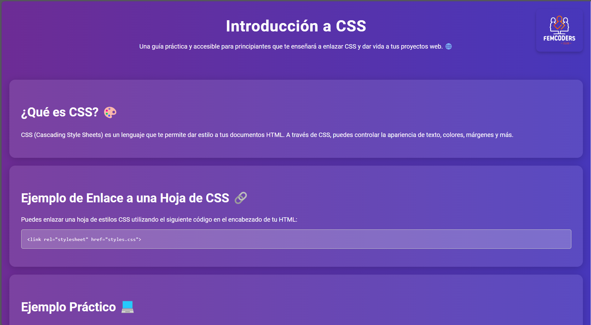

# Introducción a CSS 🎨

Este proyecto es un ejemplo básico diseñado para ayudar a los principiantes a practicar HTML y CSS. La intención es que puedan ver cómo se enlazan ambos lenguajes y cómo se aplican estilos a un documento HTML.

## Objetivos 🚀

- Aprender a enlazar una hoja de estilos CSS a un archivo HTML. 📄
- Explorar algunos estilos y propiedades CSS. 🔍
- Familiarizarse con conceptos básicos de CSS, como:

### Propiedades CSS 💡

- **overflow-x**: Controla cómo se manejan los elementos que desbordan horizontalmente el contenedor. 📏
- **max-width**: Establece un ancho máximo para un elemento, evitando que crezca más allá de un cierto tamaño. 📐
- **margin-bottom**: Define el espacio en la parte inferior de un elemento, creando separación entre él y el siguiente. ↘️
- **box-shadow**: Añade una sombra alrededor de un elemento, dándole profundidad y dimensión. 🌑
- **transition**: Permite que los cambios de propiedades CSS se realicen de forma suave durante un periodo de tiempo determinado. ⏳
- **border-radius**: Redondea las esquinas de un elemento, proporcionando un aspecto más suave y moderno. 🔵
- **z-index**: Controla la superposición de elementos, permitiendo que algunos aparezcan encima de otros. 🗂️

No te preocupes si no entiendes todos estos conceptos en este momento; en próximos posts profundizaremos en cada uno de ellos para que puedas adquirir una comprensión más sólida.

¡Esperamos que disfrutes practicando con este proyecto! 🎉 Haz un `git clone` de [https://github.com/femcodersclub/IntroduccionCSS.git](https://github.com/femcodersclub/IntroduccionCSS.git) para empezar. 🚀
